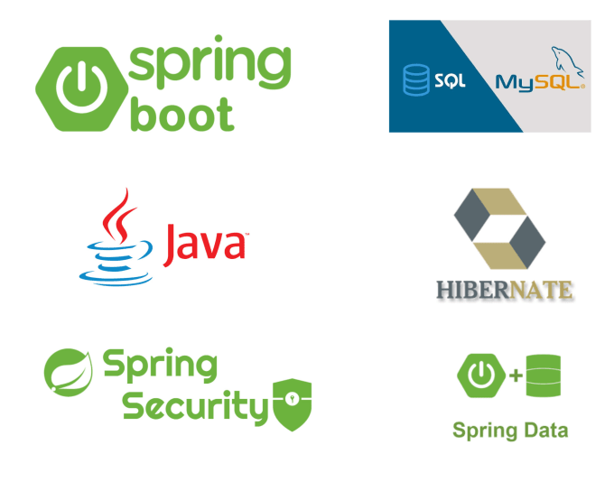
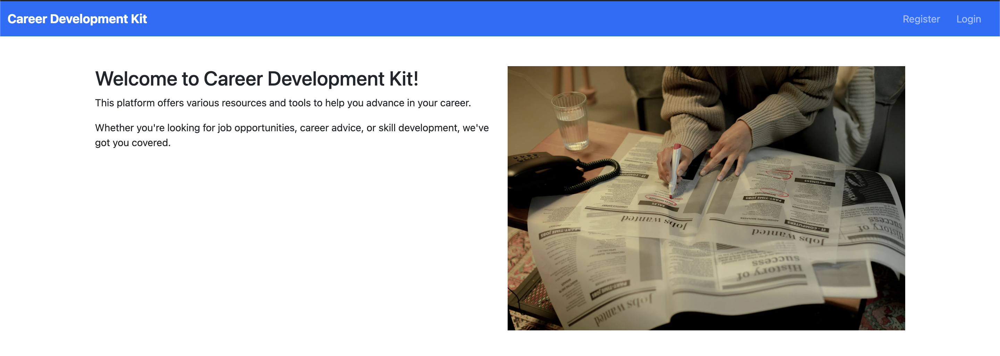
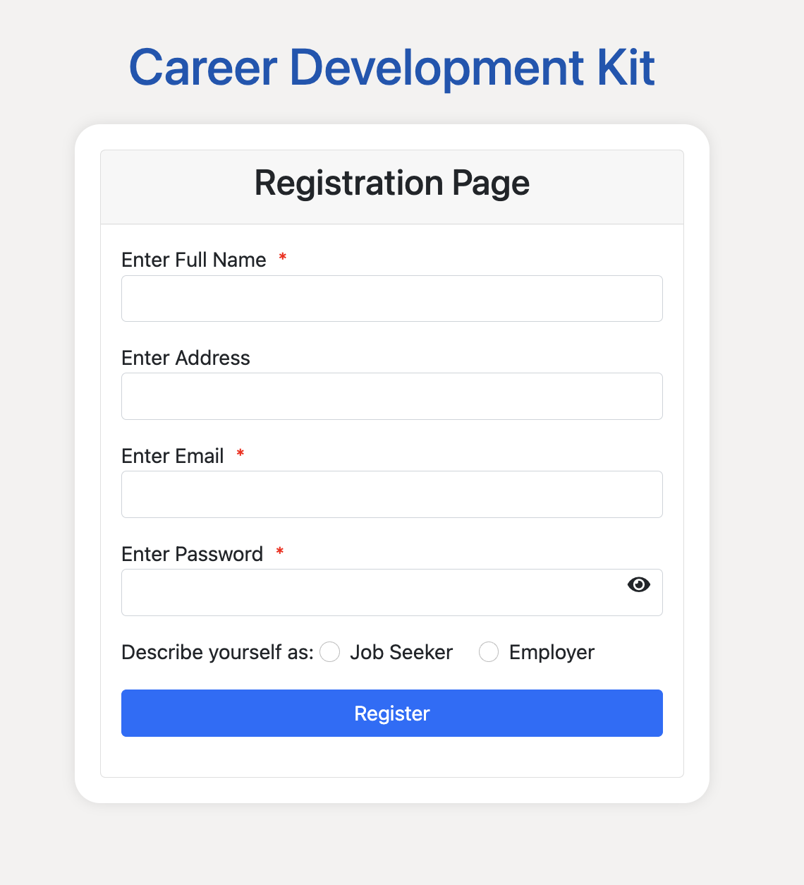
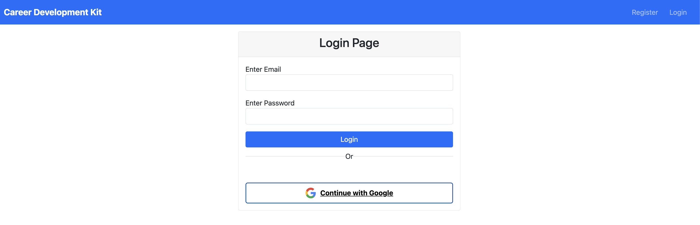
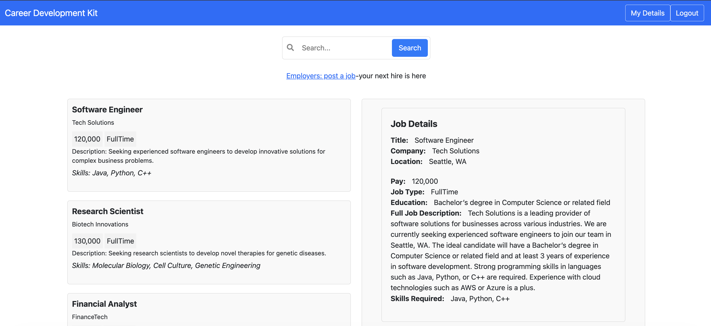

# Career Development Kit (CDK)

## About

Career Development Kit (CDK) is a Spring Boot application designed to facilitate user login, job posting, and job applications with various features aimed at enhancing career development.

## Technologies Used

- Spring Boot
- Hibernate ORM
- MySQL DB
- Spring Security
- DAO Pattern
- Interceptors and Validators
- Google OAuth2
- Apache PDFBox
- SMTP mailing
- AJAX
- jQuery
- HTML
- CSS

## Workflow

### Landing Page

The landing page serves as the home page with the URL `http://localhost:8080/`. Users have the options to either register as a new user or login as an existing user.

### Registration

Clicking on the register option directs users to `http://localhost:8080/register`, where they can input the necessary details and register. Validation is applied using Validators in the code to ensure data integrity.

### Login

Clicking on the login option takes users to `http://localhost:8080/login`, where Spring Security ensures seamless login authentication. The login form utilizes form-based authentication of Spring Security and validates against custom validation from the MySQL DB.

### Google OAuth2 Login

Users also have the option to login using Google OAuth2 client. Clicking this option redirects users to Google sign-in, and upon successful authentication, the details are sent to the server and stored in the database. Users are prompted to select their role (job seeker or employer) and then directed to the welcome page.

### Welcome Page

The welcome page (`http://localhost:8080/welcome_user.htm`) displays all the jobs posted so far. Pagination is implemented to maintain efficiency, displaying 10 records per page with the option to browse further pages.

### Job Search

Search functionality allows users to search through keywords to find relevant job postings.

### Job Details

AJAX and jQuery are utilized to display detailed job information without refreshing the page. Users can click on a job to view its details.

### Apply for a Job

Clicking on the "apply now" button on a job listing takes users to the application page (`http://localhost:8080/apply_now?jobId=1`). Here, users can upload their resume, which is parsed using Apache PDFBox to auto-populate fields. Upon submission, the resume is saved in the file system, and its path is stored in the database. A confirmation email with the resume attachment is sent to the candidate's email address.

### Employer Actions

Employers can post new jobs from the welcome page and manage their posted jobs by clicking on "my details". Here, they can update or delete job postings.

### Security Measures

Interceptors are employed to ensure that only logged-in users can access certain URLs. If a user is not logged in, they are redirected to the login page.
Passwords are encrypted and saved in DB using BCrypt.

### Email notifications

Upon applying for a job, users receive a confirmation email acknowledging their application. The email contains details confirming their application and includes an attachment of the resume they submitted. This feature ensures users have a record of their job applications and provides a seamless communication channel between applicants and employers.

### Report Generation

Employers can easily track the jobs they've posted by generating reports directly from their account. These reports are generated in PDF format, providing a clear and concise overview of the jobs posted. The PDF includes comprehensive details of each job posting, facilitating efficient management and analysis. Employers can also download these reports for offline reference, ensuring accessibility and convenience.

### Steps to Run the Project

1. **Versions Used:**
   - Spring Boot 3.2.4
   - Spring Tool Suite IDE
   - Hibernate ORM 6.2.5
   - MySQL DB
   - Tomcat 10 (Embedded in Spring Boot)

2. **Database Setup:**
   - Create a Schema named "CDK" in your MySQL database.

3. **Configuration:**
   - Check the database connection properties in the environment variables mentioned in `DAO.java` class and update the username and password according to your MySQL configuration.
   - Update the SMTP configuration in the `application.properties` file for email sending. Modify the mail ID and its details according to your SMTP credentials.
   - Ensure to check the Google OAuth client-id and client-secret in the project configuration files and update them with your own credentials.

4. **File Upload Directory:**
   - Change the directory path used for storing uploaded resumes. Search for the variable `uploadDirectory` in the class `JobApplicationController.java` and replace it with your desired directory path.

5. **Run the Application:**
   - Import the project into your Spring Tool Suite IDE.
   - Ensure that all dependencies are resolved.
   - Run the project using the embedded Tomcat server provided by Spring Boot.

6. **Access the Application:**
   - Once the application is running, access it using the appropriate URL in your web browser.
   - Register as a new user or login with existing credentials to access the features provided by the Career Development Kit (CDK).

These steps will help you set up and run the project successfully. Ensure that you have the necessary software and configurations in place before proceeding with the setup.

